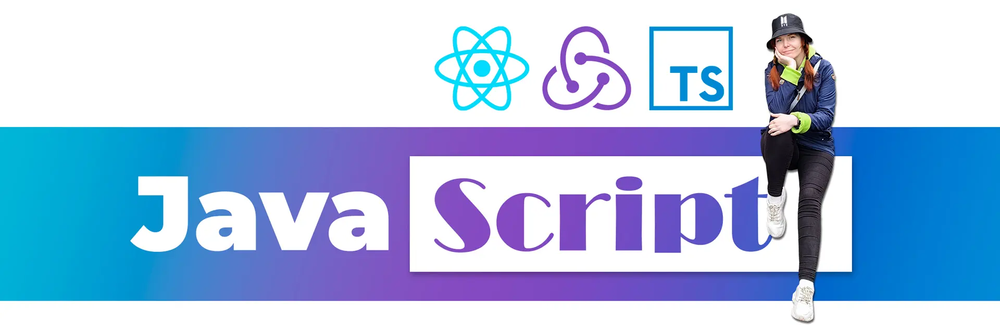

## Hi there!

My name is Tatiana and I'm a Front-end developer.

Some facts about me:

- I think JavaScript is like magic ⭐️! Just imagine: you write code using some letters and numbers and then it all turns into visually accessible forms like sliders, tabs, cards, etc. Isn't this a miracle?
- Now I practice English in the Speaking club 📢 3 times a week, improving my speaking level 💪
- Since recently, I've been inspired by Korea and I dream to visit this country, so I started learning the Korean language. Wish me luck! 🤜🏻🤛🏻
- Cat lover 😸, but I have no any.

### Technical skills:

&nbsp;
&nbsp;
&nbsp;
-764abc?style=flat-square&logo=javascript&logoColor=fbf808>)&nbsp;
&nbsp; 
&nbsp;
&nbsp;
&nbsp;
&nbsp;

### Frameworks & Libraries:

&nbsp;
&nbsp;
&nbsp;
&nbsp;
&nbsp;
&nbsp;
&nbsp;

### Tools:

&nbsp;
&nbsp;
&nbsp;
&nbsp;
&nbsp;
&nbsp;
&nbsp;
&nbsp;

### Email tools & CMS:

&nbsp;
&nbsp;
&nbsp;
&nbsp;
&nbsp;
&nbsp;
&nbsp;
   

