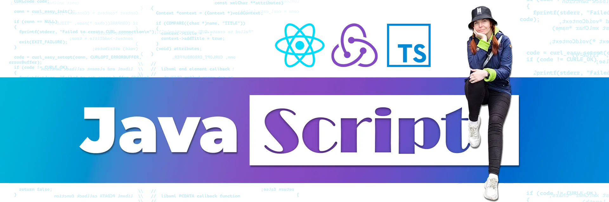

  
  
  
  

<!-- 

  

 -->

## Hi there! 

**My name is Tatiana and I'm a Front-end developer.**

Some facts about me:

- I think JavaScript is like magic! Just imagine: you write code using some letters and numbers and then it all turns into visually accessible forms like sliders, tabs, cards, etc. Isn't this a miracle? ⭐️
- Now I practice English in the Speaking club 3 times a week, improving my speaking level 💪
- Since recently, I've been inspired by Korea and I dream to visit this country, so I started learning the Korean language.
- Cat lover, but I have no any 😸

### TECHNICAL SKILLS

&nbsp;
&nbsp;
&nbsp;
-764abc?style=flat-square&logo=javascript&logoColor=FFFFFF>)&nbsp;
&nbsp; 
&nbsp;
&nbsp;
&nbsp;
&nbsp;
&nbsp;
&nbsp;

### FRAMEWORKS & LIBRARIES

&nbsp;
&nbsp;
&nbsp;
&nbsp;
&nbsp;
&nbsp;
&nbsp;
&nbsp;

### TOOLS

&nbsp;
&nbsp;
&nbsp;
&nbsp;
&nbsp;
&nbsp;
&nbsp;
&nbsp;
&nbsp;
&nbsp;
&nbsp;

### EMAIL TOOLS & CMS

&nbsp;
&nbsp;
&nbsp;
&nbsp;
&nbsp;
&nbsp;
&nbsp;
  

### MY STATS

 

    

 

    

 

    
    

  

